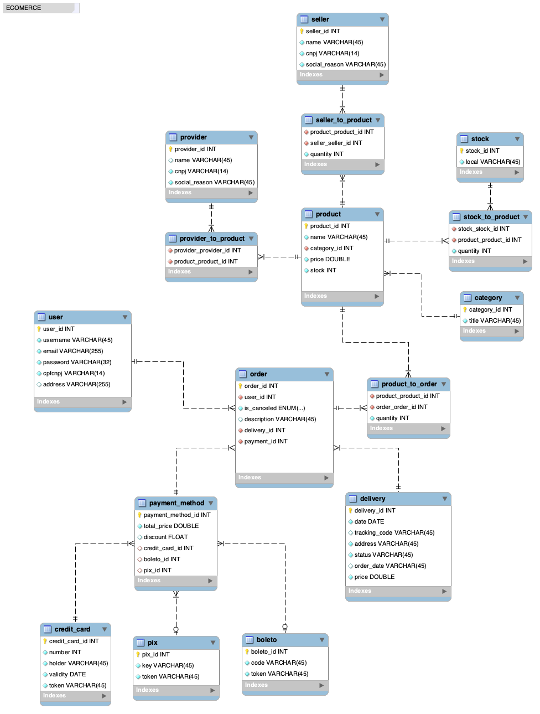

## Modelagem de dados para Ecommerce 
### Desafio da Digital Innovation One Inc.
---
### Objetivo
Criar um esquema conceitual para uma loja virtual.

### Narrativa
- Sistema de venda de produtos por uma loja virtual.
- O sistema deve contar com usuários, produtos, fornecedores, vendedores, estoques, pedidos, pagamento e entrega.
- O usuário deve ter suas informações pessoais, endereço e CPF ou CNPJ.
- O produto deve conter seu nome, categoria, preço e estoque.
- Fornecedores e vendedores devem ter CNPJ e Razão Social.
- O Estoque deve ter local.
- Os pedidos devem ter endereço, descrição, se foram cancelados ou não, produtos, pagamento e entrega.
- No pagamentos consta o valor total do pedido, desconto e se há Cartão de Crédito, Boleto ou Pix.
- O Cartão de Crédito deve ter o número do cartão, o nome do portador do cartão, validade e token.
- O Boleto deve ter o código de registro e token.
- O Pix deve ter a chave pix e o token.
- A entrega deve ter data de entrega, código de rastreio, endereço de entrega, status, data do pedido, e valor do frete.

### Relacionamentos
- Um Usuário pode ter N Pedidos.
- Um Pedido pode ter N Produtos, uma forma de pagamento e uma opção de delivery.
- Um Produto pode ter uma Categoria, quantidade em Estoque, N Fornecedores e N Vendedores.
- Um Fornecedor pode fornecer N Produtos.
- Um Vendedor pode vender N Produtos com quantidade.
- O Pagamento pode ter um Cartão de Crédito, Boleto e/ou Pix.

---

## Modelo:

---

## Desafio Lógico

Replique a modelagem do projeto lógico de banco de dados para o cenário de e-commerce. Fique atento as definições de chave primária e estrangeira, assim como as constraints presentes no cenário modelado. Perceba que dentro desta modelagem haverá relacionamentos presentes no modelo EER. Sendo assim, consulte como proceder para estes casos. Além disso, aplique o mapeamento de modelos aos refinamentos propostos no módulo de modelagem conceitual.

Assim como demonstrado durante o desafio, realize a criação do Script SQL para criação do esquema do banco de dados. Posteriormente, realize a persistência de dados para realização de testes. Especifique ainda queries mais complexas dos que apresentadas durante a explicação do desafio. Sendo assim, crie queries SQL com as cláusulas abaixo:

- Recuperações simples com SELECT Statement
- Filtros com WHERE Statement
- Crie expressões para gerar atributos derivados
- Defina ordenações dos dados com ORDER BY
- Condições de filtros aos grupos – HAVING Statement
- Crie junções entre tabelas para fornecer uma perspectiva mais complexa dos dados
- Diretrizes
- Não há um mínimo de queries a serem realizadas;
- Os tópicos supracitados devem estar presentes nas queries;
- Elabore perguntas que podem ser respondidas pelas consultas;
- As cláusulas podem estar presentes em mais de uma query;