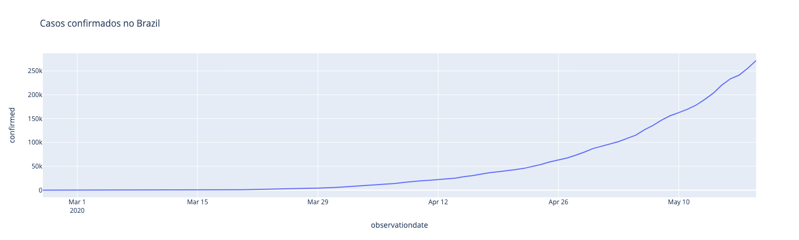

## Análise de previsão da evolução do COVID-19 no Brasil

Análise utilizando Python e Jupyter Notebook.

---

### Casos confirmados no Brasil

### Crescimento dos casos no Brasil

### Novos casos por dia

### Progressão

