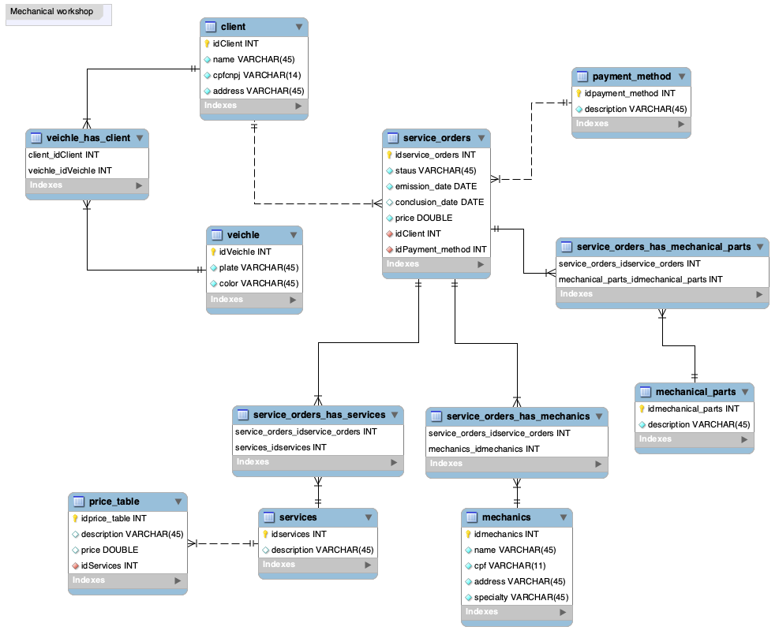

## Modelagem de dados para Oficina Mecânica
### Desafio da Digital Innovation One Inc.
---
### Objetivo:
Cria o esquema conceitual para o contexto de oficina com base na narrativa fornecida:

### Narrativa:
- Sistema de controle e gerenciamento de execução de ordens de serviço em uma oficina mecânica;
- Clientes levam veículos à oficina mecânica para serem consertados ou para passarem por revisões periódicas;
- Cada veículo é designado a uma equipe de mecânicos que identifica os serviços a serem executados e preenche uma OS com data de entrega;
- A partir da OS, calcula-se o valor de cada serviço, consultando-se uma tabela de referência de mão-de-obra;
- O valor de cada peça também irá compor a OSO cliente autoriza a execução dos serviços;
- A mesma equipe avalia e executa os serviços;
- Os mecânicos possuem código, nome, endereço e especialidade;
- Cada OS possui: n°, data de emissão, um valor, status e uma data para conclusão dos trabalhos.

### Relacionamentos:
- Um Cliente pode ter N veículos;
- Um Cliente pode ter N Ordens de Serviços;
- N Ordens de Serviços podem ter N mecânicos;
- N Ordens de Serviços podem ter N serviços;
- N Ordens de Serviços podem ter N peças;
- Uma ordem de serviço pode ter uma forma de pagamento;
- Um serviço pode ter uma tabela de preço.

---

---

### Descrição do Desafio
Para este cenário você irá utilizar seu esquema conceitual, criado no desafio do módulo de modelagem de BD com modelo ER, para criar o esquema lógico para o contexto de uma oficina. Neste desafio, você definirá todas as etapas. Desde o esquema até a implementação do banco de dados. Sendo assim, neste projeto você será o protagonista. Tenha os mesmos cuidados, apontados no desafio anterior, ao modelar o esquema utilizando o modelo relacional.

Após a criação do esquema lógico, realize a criação do Script SQL para criação do esquema do banco de dados. Posteriormente, realize a persistência de dados para realização de testes. Especifique ainda queries mais complexas do que apresentadas durante a explicação do desafio. Sendo assim, crie queries SQL com as cláusulas abaixo:

- Recuperações simples com SELECT Statement;
- Filtros com WHERE Statement;
- Crie expressões para gerar atributos derivados;
- Defina ordenações dos dados com ORDER BY;
- Condições de filtros aos grupos – HAVING Statement;
- Crie junções entre tabelas para fornecer uma perspectiva mais complexa dos dados;

### Diretrizes
- Não há um mínimo de queries a serem realizadas;
- Os tópicos supracitados devem estar presentes nas queries;
- Elabore perguntas que podem ser respondidas pelas consultas
- As cláusulas podem estar presentes em mais de uma query
- O projeto deverá ser adicionado a um repositório do Github para futura avaliação do desafio de projeto. Adicione ao Readme a descrição do projeto lógico para fornecer o contexto sobre seu esquema lógico apresentado.